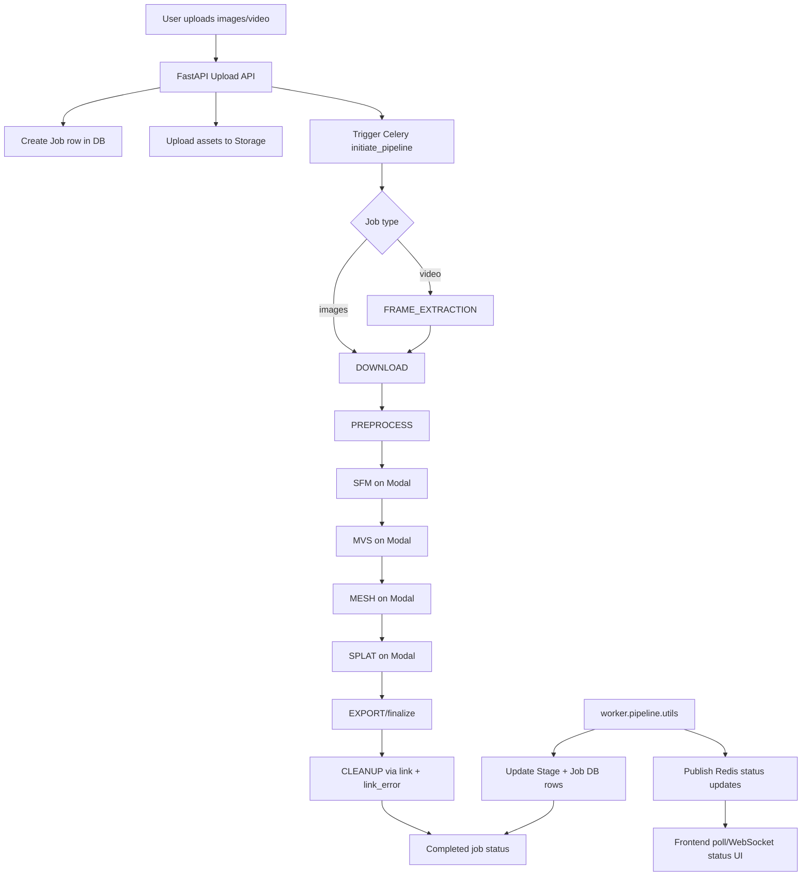

# Project Flow And Remaining Changes

This document summarizes the current architecture of the `3d_scanner` project, shows the end-to-end runtime flow, and lists remaining implementation changes in priority order.

## 1) System Architecture (Current)

- **Backend API**: `backend/main.py`
  - FastAPI app, API routers, static frontend serving, health endpoint, websocket bridge.
- **Upload + Orchestration API**: `backend/api/upload.py`
  - Creates jobs, uploads assets to storage, triggers Celery pipeline.
- **Status API**: `backend/api/scans.py`
  - Job status and basic result endpoints.
- **Task Queue**: `backend/core/celery_app.py`
  - Celery app and worker configuration.
- **Pipeline Orchestration + Stages**: `worker/pipeline/tasks.py`
  - Builds stage chain and executes CPU/GPU stages.
- **Stage State + Broadcasts**: `worker/pipeline/utils.py`
  - DB stage/job status updates and Redis pub/sub notifications.
- **Video Preprocessing**: `worker/pipeline/video_utils.py`
  - Frame extraction + validation.
- **GPU Worker on Modal**: `modal_worker/modal_app.py`, `modal_worker/gpu_pipeline.py`
  - Runs SFM/MVS/MESH/SPLAT remotely and pushes outputs.
- **Storage Layer**: `storage/factory.py`, `storage/fallback_provider.py`, providers in `storage/*.py`
  - Cloudinary + Modal fallback pattern.
- **Frontend**: `frontend/index.html`, `frontend/mobile.html`, `frontend/viewer/index.html`
  - Upload UX, polling, progress UI, 3D preview/download.

## 2) End-to-End Flow Diagram

## 3) Current Pipeline Status

- Pipeline sequencing and Modal invocation are functioning:
  - `SFM -> MVS -> MESH` are being reached.
- `MESH` is currently configured to soft-fail and continue (option 2 behavior).
- `SPLAT` has been enabled in API trigger kwargs (`enable_splat=True`) and in pipeline default.
- Cleanup execution is linked as `link` and `link_error` to reduce orphaned assets.

## 4) Remaining Changes (Priority)

### P0 - Reliability / Correctness

1. **Finish SPLAT stage verification in stage DB records**
   - Confirm `SPLAT` stage row is consistently created and marked `COMPLETED` for successful end-to-end jobs.
   - If missing, verify chain composition at runtime and queued task receipt for `task_splat`.

2. **Stabilize PREPROCESS under load**
   - Intermittent `Path not defined`/worker skew indicates stale worker process scenarios.
   - Enforce single worker deployment process or coordinated restart strategy.
   - Add startup self-check log that prints code version/hash for task module to detect stale workers.

3. **Cleanup robustness for fallback storage**
   - Cleanup currently logs benign errors (e.g., missing files).
   - Make delete operation idempotent per provider and report per-path failures as warnings without noise.

### P1 - UX / API Contract Alignment

4. **Align frontend routes with backend APIs**
   - Frontend references some routes not present in backend (`/scans/{id}/progress`, `/cancel`, `/api/v1/images`, etc.).
   - Either implement these endpoints or update frontend to current routes.

5. **Return richer result metadata**
   - Ensure `Job.results` includes canonical URLs for mesh/splat/point-cloud outputs and warning fields.
   - Expose these clearly in `/api/v1/scans/{job_id}/results`.

### P2 - Observability / Ops

6. **Add a pipeline run summary endpoint**
   - Include ordered stage durations, warning/error summary, and final artifact URLs.

7. **Add deterministic integration tests**
   - `tests/integration/test_video_pipeline.py` for mocked video/frame extraction path.
   - Fallback storage test script to verify Cloudinary outage -> Modal fallback.

## 5) Recommended Immediate Work Plan

1. Run one controlled single-job E2E until terminal state.
2. Inspect `Stage` table sequence to confirm `SPLAT` appears.
3. Patch if `SPLAT` absent; retest.
4. Update results payload contract and viewer usage.
5. Add integration tests to prevent regressions.

## 6) Quick Ownership Map (Where to Change What)

- **Pipeline logic**: `worker/pipeline/tasks.py`
- **Modal GPU behavior**: `modal_worker/gpu_pipeline.py`
- **Upload/start behavior**: `backend/api/upload.py`
- **Status/result API contract**: `backend/api/scans.py`
- **Stage/job state transitions**: `worker/pipeline/utils.py`
- **Storage fallback behavior**: `storage/fallback_provider.py`, `storage/cloudinary_provider.py`
- **Frontend polling + result rendering**: `frontend/index.html`, `frontend/mobile.html`

